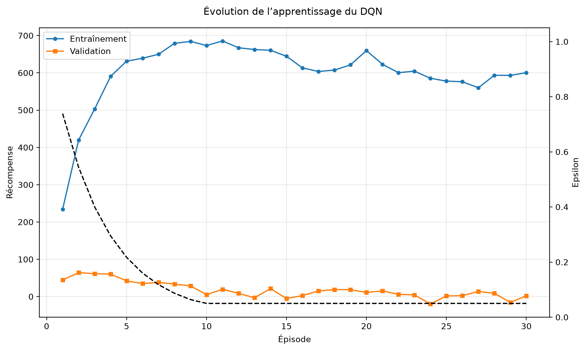
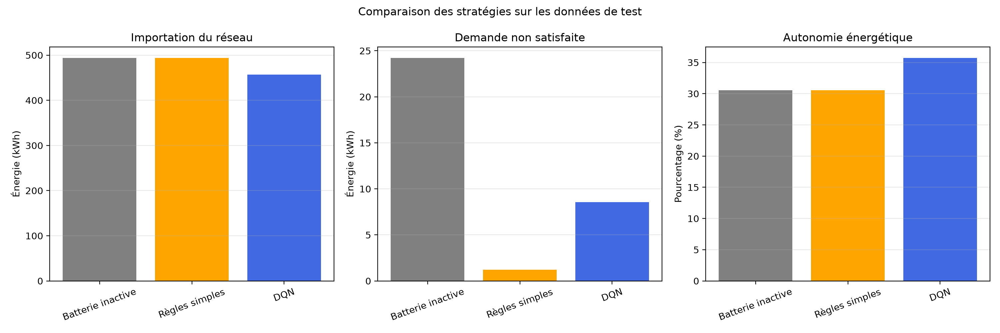

# Optimisation de la gestion énergétique d’une maison solaire par DQN

Projet académique de Reinforcement Learning réalisé dans le cadre du cours de Master en Intelligence Artificielle du Dakar Institute of Technology.

Le projet consiste à entraîner un agent Deep Q-Network, implémenté manuellement avec PyTorch, afin d’optimiser la gestion de la batterie d’une maison équipée de panneaux solaires et connectée à un réseau électrique sujet à des coupures.

## Membres du groupe

| Membre | Contribution principale |
|---|---|
| Metanha | Préparation, nettoyage et normalisation des données énergétiques |
| Takor | Modélisation de l’environnement énergétique et de la batterie |
| Ndiaye | Implémentation manuelle du DQN avec PyTorch |
| Davy | Intégration, simulation des coupures, entraînement, évaluation et visualisation |

## Objectifs

À chaque heure, la maison possède :

- une production photovoltaïque ;
- une consommation électrique ;
- une batterie ;
- un réseau électrique disponible ou indisponible.

L’agent doit décider s’il faut :

1. ne rien faire ;
2. charger la batterie ;
3. décharger la batterie.

Les objectifs principaux sont :

- améliorer l’autonomie énergétique de la maison ;
- réduire l’importation d’électricité depuis le réseau ;
- limiter la demande non satisfaite pendant les coupures ;
- préserver autant que possible la durée de vie de la batterie.

La revente d’électricité au réseau n’est pas prise en compte.

## Organisation du projet

Le système suit la chaîne suivante :

```text
Données énergétiques
        ↓
Nettoyage et normalisation
        ↓
Simulation des coupures du réseau
        ↓
Environnement énergétique
        ↓
Agent DQN
        ↓
Entraînement et validation
        ↓
Évaluation sur les données de test
        ↓
Comparaison avec des stratégies de référence
```

## Données

Le projet utilise un fichier contenant la production photovoltaïque et la consommation électrique horaire de l’année 2023.

Le fichier original est :

```text
data/Dataset.xlsx
```

La feuille utilisée est :

```text
2023 data
```

Les colonnes originales exploitées sont :

```text
Date
PV generation (kW)
Consumption (kW)
```

Le jeu de données utilisé est publié sur Zenodo :

https://zenodo.org/records/15394961

## Préparation des données

Le script suivant assure la préparation des données :

```text
src/prepare_data.py
```

Il réalise les opérations suivantes :

- lecture de la feuille `2023 data` ;
- conversion des dates ;
- conversion des valeurs numériques ;
- suppression des lignes invalides ;
- suppression des doublons ;
- tri chronologique des observations ;
- remplacement des valeurs énergétiques négatives par zéro ;
- normalisation de la consommation annuelle ;
- normalisation de la production photovoltaïque ;
- création du fichier final au format CSV.

La consommation est ramenée à :

```text
4 500 kWh par an
```

La production solaire est ramenée à une installation de :

```text
5 kWc
```

Le fichier préparé est :

```text
data/processed_energy.csv
```

Il contient 8 760 observations horaires et les colonnes suivantes :

```text
timestamp
load_kwh
pv_kwh
```

## Découpage des données

Les données sont séparées chronologiquement afin d’éviter de mélanger les observations passées et futures.

| Ensemble | Durée | Nombre d’observations |
|---|---:|---:|
| Entraînement | 255 jours | 6 120 |
| Validation | 55 jours | 1 320 |
| Test | 55 jours | 1 320 |

Le découpage aléatoire n’est pas utilisé, car il serait inadapté à une série temporelle.

## Simulation des coupures

Le module suivant adapte les données à l’environnement et simule les coupures :

```text
src/integration_data.py
```

Il transforme les colonnes :

```text
load_kwh → consumption
pv_kwh   → pv_production
```

Il ajoute également la colonne :

```text
grid_available
```

Sa signification est :

- `1` : réseau disponible ;
- `0` : coupure du réseau.

Avec la graine aléatoire `42`, la simulation produit :

- 392 heures de coupure ;
- un taux de disponibilité du réseau d’environ 95,53 % ;
- des coupures d’une durée comprise entre 1 et 4 heures.

L’utilisation d’une graine fixe rend l’expérience reproductible.

## Environnement de Reinforcement Learning

L’environnement énergétique est défini dans :

```text
src/environment/energy_environment.py
```

La classe principale est :

```python
EnergyEnvironment
```

### État

L’état observé par l’agent contient six valeurs :

```text
[
    production_solaire_normalisée,
    consommation_normalisée,
    niveau_de_la_batterie,
    disponibilité_du_réseau,
    sinus_de_l_heure,
    cosinus_de_l_heure
]
```

Les composantes sinus et cosinus permettent de représenter le caractère cyclique des heures de la journée.

### Actions

L’agent peut choisir entre trois actions discrètes :

| Action | Valeur | Signification |
|---|---:|---|
| `IDLE` | 0 | Ne rien faire |
| `CHARGE` | 1 | Charger la batterie avec le surplus solaire |
| `DISCHARGE` | 2 | Décharger la batterie pour couvrir un déficit |

### Batterie

Les principales caractéristiques de la batterie sont :

| Paramètre | Valeur |
|---|---:|
| Capacité | 10 kWh |
| État de charge initial | 50 % |
| Puissance maximale | 2 kW |
| Rendement | 95 % |

### Récompense

La récompense encourage l’utilisation de l’énergie solaire et pénalise :

- l’importation d’électricité depuis le réseau ;
- la demande non satisfaite ;
- l’utilisation de la batterie.

La fonction utilisée est :

```text
récompense =
    énergie_solaire_utilisée
    - importation_du_réseau
    - 5 × demande_non_satisfaite
    - 0,01 × décharge_de_la_batterie
```

La demande non satisfaite reçoit la pénalité la plus élevée, car elle correspond à une consommation qui n’a pas pu être alimentée pendant une coupure.

## Agent DQN

Le DQN est implémenté manuellement avec PyTorch, sans utiliser de bibliothèque spécialisée de Reinforcement Learning.

Les fichiers principaux sont :

```text
src/dqn.py
src/agent.py
src/replay_buffer.py
```

### Architecture du réseau

```text
Entrée : 6 variables
        ↓
Couche cachée : 64 neurones + ReLU
        ↓
Couche cachée : 64 neurones + ReLU
        ↓
Sortie : 3 valeurs Q
```

Chaque valeur de sortie représente la valeur estimée d’une action.

### Composants implémentés

Le projet contient :

- un réseau de politique ;
- un réseau cible ;
- un replay buffer ;
- une stratégie epsilon-greedy ;
- l’équation de Bellman ;
- une fonction de perte Smooth L1 ;
- un optimiseur Adam ;
- le gradient clipping ;
- la synchronisation périodique du réseau cible ;
- la sauvegarde et le chargement du modèle.

### Hyperparamètres principaux

| Paramètre | Valeur |
|---|---:|
| Taille de l’état | 6 |
| Nombre d’actions | 3 |
| Taille des couches cachées | 64 |
| Taille du batch | 64 |
| Capacité du replay buffer | 50 000 |
| Gamma | 0,99 |
| Learning rate | 0,001 |
| Epsilon initial | 1,00 |
| Epsilon minimum | 0,05 |
| Epsilon decay | 0,99995 |
| Fréquence de mise à jour du réseau cible | 250 |
| Nombre d’épisodes | 10 |

## Installation

### Prérequis

- Python 3.11 recommandé ;
- Git ;
- pip.

### Cloner le dépôt

```powershell
git clone https://github.com/HAFING/solar-home-energy-dqn.git
cd solar-home-energy-dqn
```

### Créer l’environnement virtuel

```powershell
python -m venv .venv
```

### Activer l’environnement sous PowerShell

```powershell
Set-ExecutionPolicy -Scope Process -ExecutionPolicy RemoteSigned
.\.venv\Scripts\Activate.ps1
```

### Mettre pip à jour

```powershell
python -m pip install --upgrade pip
```

### Installer les dépendances

```powershell
python -m pip install -r requirements.txt
```

## Utilisation

### Préparer les données

```powershell
python -m src.prepare_data
```

Cette commande génère :

```text
data/processed_energy.csv
```

### Vérifier l’intégration des données

```powershell
python -m src.integration_data
```

Cette commande affiche notamment :

- le nombre total d’observations ;
- la taille des trois ensembles ;
- le nombre d’heures de coupure ;
- le taux de disponibilité du réseau.

### Entraîner le DQN

Pour effectuer un test rapide :

```powershell
python train.py --episodes 1
```

Pour reproduire l’expérience principale :

```powershell
python train.py --episodes 10
```

Le meilleur modèle est enregistré dans :

```text
models/best_dqn.pt
```

Les métriques sont enregistrées dans :

```text
results/training_metrics.csv
```

### Évaluer le modèle

```powershell
python evaluate.py
```

L’évaluation compare trois stratégies :

- `idle` : la batterie n’est jamais utilisée ;
- `rule_based` : la batterie est contrôlée par des règles simples ;
- `dqn` : les actions sont choisies par le modèle entraîné.

Les résultats sont enregistrés dans :

```text
results/evaluation_results.csv
```

### Générer les graphiques

```powershell
python plot_results.py
```

Les graphiques sont enregistrés dans :

```text
results/figures/training_progress.png
results/figures/policy_comparison.png
```

### Exécuter les tests

Pour lancer l’ensemble des tests :

```powershell
python -m pytest -q
```

Résultat obtenu lors de l’expérience :

```text
36 passed
```

## Résultats de l’entraînement

L’entraînement principal a été réalisé sur 10 épisodes.

La meilleure récompense de validation obtenue est :

```text
58,37
```

Le meilleur modèle a été obtenu au deuxième épisode et sauvegardé automatiquement.



## Résultats sur les données de test

| Politique | Récompense | Import réseau | Demande non satisfaite | Autonomie | Cycles équivalents |
|---|---:|---:|---:|---:|---:|
| Batterie inactive | -421,79 | 493,75 kWh | 24,22 kWh | 30,56 % | 0,00 |
| Règles simples | -307,01 | 493,75 kWh | 1,21 kWh | 30,56 % | 2,42 |
| DQN | -307,44 | 457,08 kWh | 8,57 kWh | 35,71 % | 5,51 |



## Analyse des résultats

Comparativement à une batterie inactive, le DQN :

- réduit l’importation du réseau de 36,67 kWh ;
- augmente l’autonomie énergétique de 5,15 points ;
- réduit la demande non satisfaite de 24,22 à 8,57 kWh ;
- améliore fortement la récompense globale.

La stratégie à règles obtient néanmoins une récompense légèrement supérieure au DQN et limite mieux la demande non satisfaite.

Le DQN décharge plus fréquemment la batterie pour réduire l’importation depuis le réseau. Cette politique améliore l’autonomie, mais augmente le nombre de cycles de la batterie et peut laisser moins d’énergie disponible lorsqu’une coupure survient.

Les résultats montrent donc un compromis entre :

- l’autonomie énergétique ;
- la satisfaction de la demande pendant les coupures ;
- la préservation de la batterie.

## Limites

Les principales limites de cette version sont :

- seulement 10 épisodes d’entraînement ;
- une seule graine aléatoire utilisée ;
- des coupures simulées et non issues de données réelles ;
- absence de prévision de la production solaire ;
- absence de prévision de la consommation ;
- absence de prévision des futures coupures ;
- fonction de récompense encore perfectible ;
- DQN moins performant que la stratégie à règles sur certains critères ;
- utilisation relativement importante de la batterie par le DQN.

## Améliorations possibles

Le projet pourrait être amélioré en :

- augmentant le nombre d’épisodes ;
- répétant les expériences avec plusieurs graines ;
- ajustant les coefficients de la récompense ;
- pénalisant davantage les niveaux de batterie trop faibles ;
- pénalisant plus fortement les cycles de charge et de décharge ;
- ajoutant une prévision de la production solaire ;
- ajoutant une prévision de la consommation ;
- ajoutant une estimation du risque de coupure ;
- recherchant automatiquement les meilleurs hyperparamètres ;
- comparant DQN à Double DQN ou Dueling DQN ;
- ajoutant une interface interactive avec Gradio.

## Structure du dépôt

```text
solar-home-energy-dqn/
├── data/
│   ├── Dataset.xlsx
│   └── processed_energy.csv
├── models/
│   └── best_dqn.pt
├── results/
│   ├── training_metrics.csv
│   ├── evaluation_results.csv
│   └── figures/
│       ├── training_progress.png
│       └── policy_comparison.png
├── src/
│   ├── agent.py
│   ├── dqn.py
│   ├── replay_buffer.py
│   ├── prepare_data.py
│   ├── integration_data.py
│   └── environment/
│       └── energy_environment.py
├── tests/
├── train.py
├── evaluate.py
├── plot_results.py
├── requirements.txt
└── README.md
```

## Collaboration et versionnement

Le projet a été développé avec des branches Git distinctes :

```text
data/energy-pipeline
feature/energy-environment
feature/dqn-network
integration/training-evaluation
```

Les contributions ont été intégrées progressivement avec des commits et des Pull Requests afin de conserver la traçabilité du travail de chaque membre.

## Conclusion

Ce projet met en œuvre toute la chaîne d’un problème de Reinforcement Learning :

```text
Données
    ↓
Environnement
    ↓
États, actions et récompenses
    ↓
Agent DQN
    ↓
Entraînement
    ↓
Validation
    ↓
Évaluation
```

Le DQN améliore l’autonomie énergétique de la maison et réduit sa dépendance au réseau. Les résultats montrent également que la conception de la récompense joue un rôle essentiel pour équilibrer autonomie, fiabilité énergétique et durée de vie de la batterie.